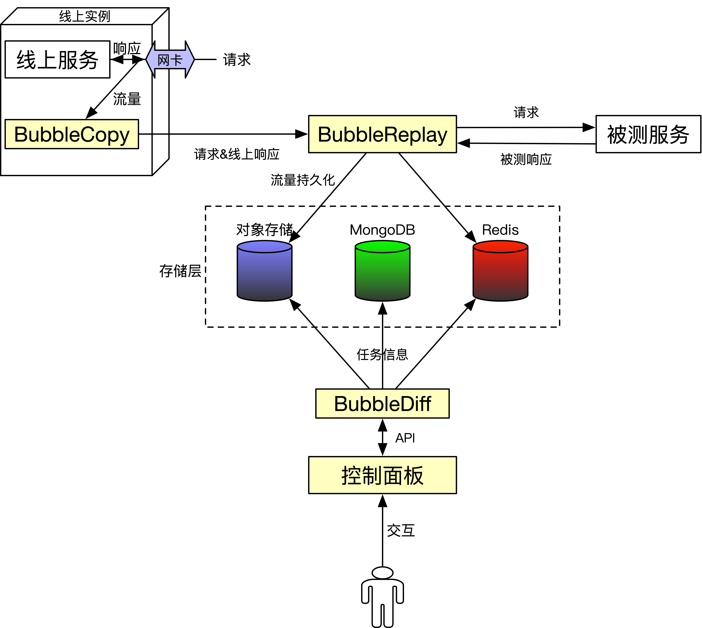

# BubbleDiff

> 随着微服务架构的兴起，服务之间的依赖关系变的越来越复杂，软件测试也面临新的挑战：系统升级频繁、服务依赖众多等等。常见的测试方案（如：单元测试、系统测试等）构造和维护测试用例成本高，特别是业务复杂的场景，构造测试数据难。为此，我们需要开发一套流量重放系统BubbleDiff来缓解上述问题。
>
> BubbleDiff适用于HTTP/1.1协议的Web服务，HTTP是一种基于TCP传输层，能够获取如HTML这样的网络资源的通讯协议。它是在 Web 上进行数据交换的基础，是一种client-server协议，也就是说，请求通常是由像浏览器这样的接受方发起的。一个完整的Web文档通常是由不同的子文档拼接而成的，像是文本、布局描述、图片、视频、脚本等等。目前业界主流的业务系统,如广告ToB系统、大数据管理平台等系统都是HTTP服务。熟悉HTTP应用层通信协议对实现流量重放系统有很重要的意义,虽然每种应用层协议各不相同,但对于TCP流处理思想是相似的,可以扩展到其他协议，如Thrift的二进制协议，甚至到MySQL/Redis通信协议，也可以配合对应方法解析完成对流量的重放处理。

## 整体架构

